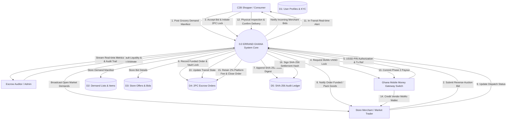

# Architecture Level 0 Data Flow Diagram (DFD)
## ERRAND GHANA: Demand-Led C2B Marketplace & MoMo Escrow Engine

- **Course**: CSCD 602: Advanced Software Engineering, University of Ghana, Legon
- **Developer / Student**: Theophilus Dorh (Student ID: `22425676`)

---

