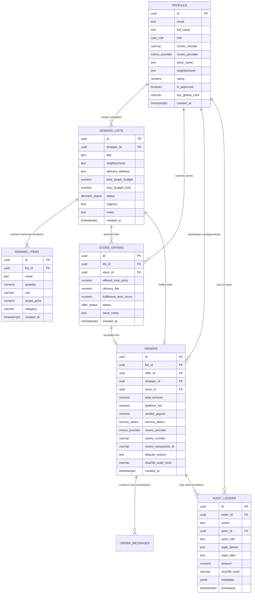

# Database Entity-Relationship Diagram (ERD)
## ERRAND GHANA: PostgreSQL 15 & Supabase Data Model

- **Course**: CSCD 602: Advanced Software Engineering, University of Ghana, Legon
- **Developer / Student**: Theophilus Dorh (Student ID: `22425676`)

---

