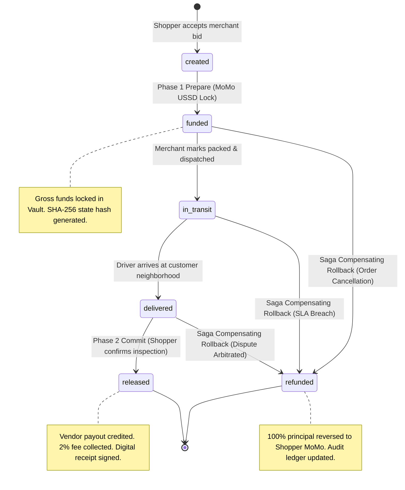

# Distributed Saga 2-Phase Commit (2PC) State Machine
## ERRAND GHANA: Demand-Led C2B Marketplace & MoMo Escrow Engine

- **Course**: CSCD 602: Advanced Software Engineering, University of Ghana, Legon
- **Developer / Student**: Theophilus Dorh (Student ID: `22425676`)

---

## 1. 2PC Escrow Finite State Machine (FSM)

---

## 2. Distributed State Transition Invariant Table

| Initial State | Event / Trigger | Target State | Saga Action | Financial Invariant | SHA-256 Signed? |
| :--- | :--- | :--- | :--- | :--- | :--- |
| `UNINITIALIZED` | `POST /api/orders/accept-offer` | `created` | Saga Step 1 | $\text{Vault} = 0$ | No |
| `created` | `POST /api/escrow/prepare-momo` | `funded` | **2PC Phase 1 (Prepare)** | $\text{Vault} \mathrel{+}= \text{Gross Amount}$ | **Yes** |
| `funded` | `PATCH /api/orders/:id/status (in_transit)` | `in_transit` | Saga Step 2 | $\text{Vault}$ unchanged | **Yes** |
| `in_transit` | `PATCH /api/orders/:id/status (delivered)` | `delivered` | Saga Step 3 | $\text{Vault}$ unchanged | **Yes** |
| `delivered` | `POST /api/escrow/commit-release` | `released` | **2PC Phase 2 (Commit)** | $\text{Vault} \mathrel{-}= \text{Gross Amount}$; $\text{Merchant} \mathrel{+}= \text{Payout}$; $\text{Platform} \mathrel{+}= 2\%$ | **Yes** |
| `funded`/`in_transit`/`delivered` | `POST /api/escrow/dispute-refund` | `refunded` | **Saga Compensating Rollback** | $\text{Vault} \mathrel{-}= \text{Gross Amount}$; $\text{Shopper} \mathrel{+}= \text{Gross Amount}$ | **Yes** |
