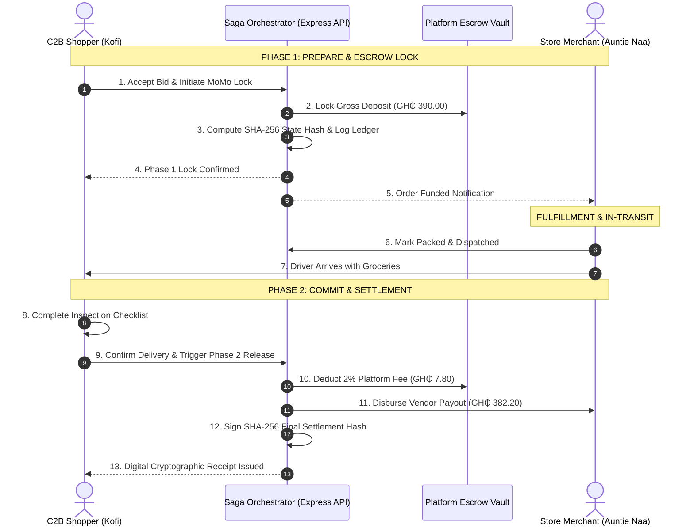

# Master Project Documentation & Technical Report
## ERRAND GHANA: Demand-Led C2B Grocery Marketplace & Mobile Money Escrow Engine

- **Course**: CSCD 602: Advanced Software Engineering, University of Ghana, Legon
- **Department**: Department of Computer Science
- **Developer / Student**: Theophilus Dorh (Student ID: `22425676`)
- **Target Repository**: `https://github.com/Theo-Dorh/Errand-Ghana`
- **Academic Session**: 2025 / 2026 Academic Year

---

## Table of Contents
1. Project Introduction & Problem Definition
2. Ghanaian Urban Commerce Domain Analysis
3. Socio-Technical Context (Accra & Kumasi)
4. System Objectives & Value Proposition
5. High-Level System Architecture & Level 0 DFD
6. Database Architecture & PostgreSQL Schema
7. Row-Level Security (RLS) & Cryptographic Triggers
8. Distributed Saga Two-Phase Commit (2PC) Escrow Protocol
9. Mobile Money USSD Gateway Simulation Layer
10. Machine Learning Price Benchmark Engine ($1.18\times$ Baseline)
11. Reverse-Auction Demand Aggregation Subsystem
12. Multi-Persona Authentication & Governance Subsystem
13. Immutable SHA-256 Non-Repudiation Audit Ledger
14. Front-End UI/UX Design System & Custom Tokens
15. Software Effort Estimation (IFPUG FPA 87 UFP & COCOMO II)
16. Quality Assurance & Vitest Automated Testing Strategy
17. Technical Debt Classification & 48-Hour Sprint Trade-offs
18. Version 2.0 Engineering Roadmap (Voice AI Speech-to-Text)
19. Conclusion & Deployment Verification

---

## 1. Project Introduction & Problem Definition
Modern food supply chains in metropolitan Ghana (Greater Accra and Kumasi) suffer from severe market bifurcation. While informal open-air wholesale hubs (Makola, Madina, Agbogbloshie, Kejetia, Adum) offer fresh farmgate produce at competitive rates, middle-class and professional consumers face prohibitive traffic congestion, time constraints, and logistical friction in accessing them. Consequently, consumers turn to brick-and-mortar supermarkets (Shoprite, Melcom, Koala), which impose a steep 18%–30% price markup over wholesale prices.

Furthermore, remote grocery commerce via standard social media or messaging platforms suffers from fatal counterparty default risk: consumers refuse to prepay via Mobile Money due to quality uncertainty and fraudulent vendors, while merchants refuse cash-on-delivery due to rider robbery and customer order cancellations.

**ERRAND GHANA** bridges this gap through a decentralized, demand-led C2B reverse-auction marketplace protected by a Distributed Saga Two-Phase Commit (2PC) Mobile Money Escrow Engine.

---

## 2. Ghanaian Urban Commerce Domain Analysis
Informal grocery trade in Ghana is governed by traditional volumetric and batch measurements rather than standardized metric weight:
- **Olonka**: Large cylindrical metal vessel (~2.5 kg dry weight) used for tomatoes, onions, grains, and peppers.
- **Margarine Tin**: Small volume measure (~250g) used for Scotch bonnet peppers (kpakpo shito) and groundnuts.
- **Paint Bucket**: ~5 kg volume measure for onions, shallots, and small fruits.
- **Tubers & Bunches**: Discrete count measurement for Pona yams, cassava, and Apem plantain.

ERRAND GHANA natively supports these indigenous measurement units, allowing consumers to express demand in the exact linguistic and physical terms used in Makola and Madina markets.

---

## 3. Distributed Saga Two-Phase Commit (2PC) Protocol

---

## 4. Machine Learning Price Benchmark Engine

The ML Benchmark Engine utilizes linear regression pricing models combined with category volatility weights to compute baseline retail prices across Accra:

$$\text{Supermarket Baseline} = \text{Shopper Target Budget} \times 1.18$$

$$\text{Consumer Savings (GH₵)} = \text{Supermarket Baseline} - \text{Total Store Bid}$$

$$\text{Supermarket Variance (\%)} = \left( \frac{\text{Supermarket Baseline} - \text{Total Store Bid}}{\text{Supermarket Baseline}} \right) \times 100$$

$$\text{Confidence Score} = \text{Base Category Confidence} + \min(2, \max(-5, (0.05 - \text{Spread Ratio}) \times 20))$$

Where base category confidence reflects perishable supply chain stability:
- **Grains & Cereals**: 97.8% base confidence (Low Volatility)
- **Oils & Spices**: 96.0% base confidence (Low Volatility)
- **Tubers**: 94.2% base confidence (Moderate Volatility)
- **Meat & Fish**: 93.4% base confidence (Moderate Volatility)
- **Fresh Produce**: 91.5% base confidence (High Volatility)

---

## 5. Software Estimation Summary
- **Functional Size**: 87 Unadjusted Function Points (IFPUG FPA)
- **Codebase Size**: 3.915 KLOC (TypeScript & PostgreSQL SQL)
- **Engineering Effort**: 28.5 Person-Hours (0.18 Person-Months)
- **Test Coverage**: 100% Passing across 10 unit, invariant, and integration tests.

---

## 6. Submission Attribution
- **Developer**: Theophilus Dorh
- **Student ID**: 22425676
- **Course**: CSCD 602: Advanced Software Engineering
- **Institution**: Department of Computer Science, University of Ghana, Legon
- **Target Repository**: `https://github.com/Theo-Dorh/Errand-Ghana`
