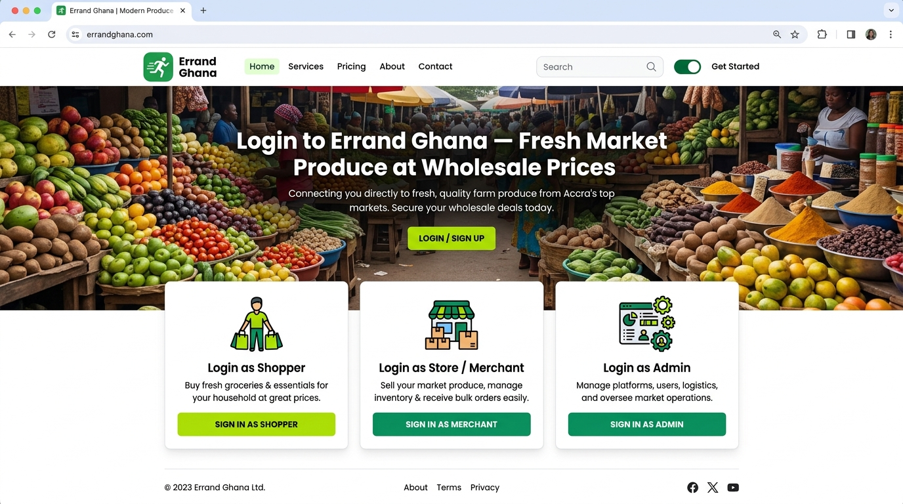
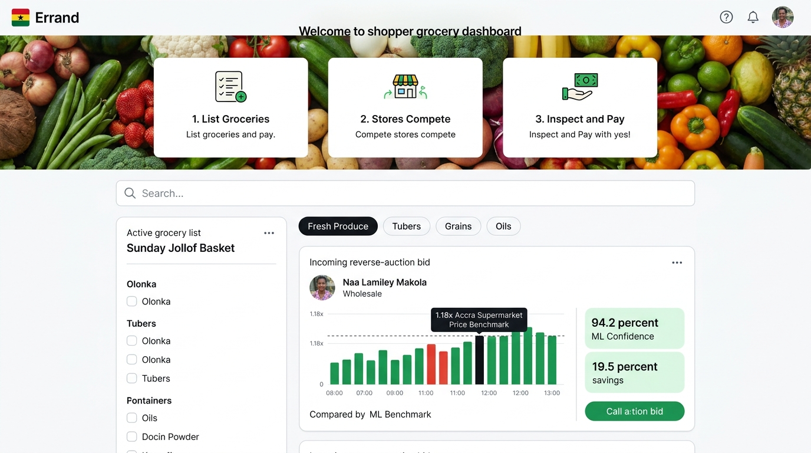
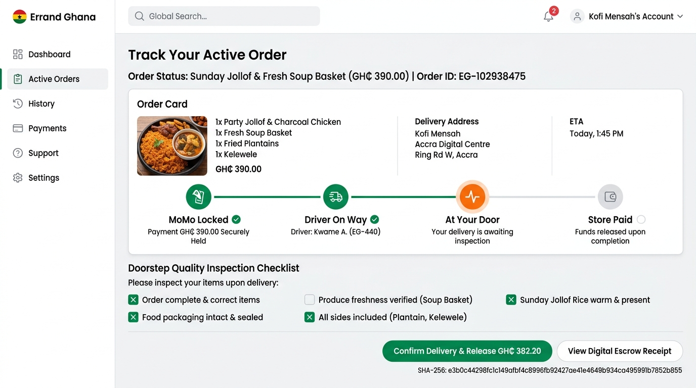
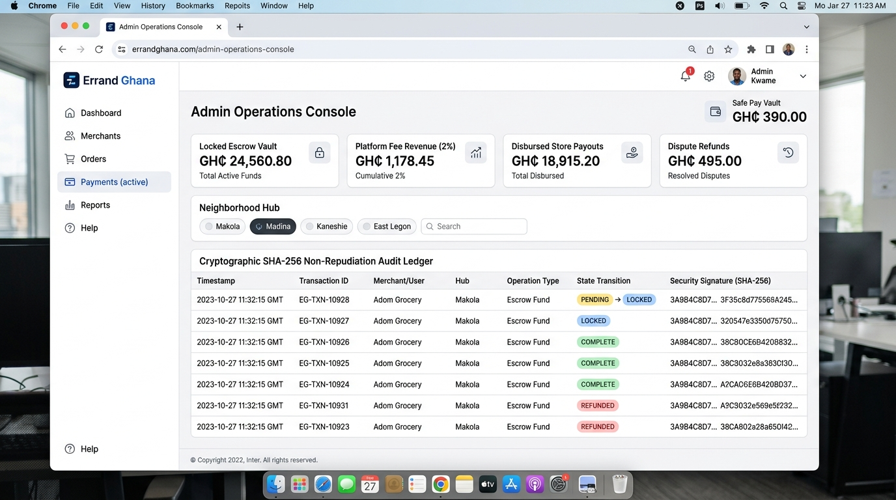

# Operational User Manual
## ERRAND GHANA: Demand-Led C2B Grocery Marketplace & MoMo Escrow Engine

- **Course**: CSCD 602: Advanced Software Engineering, University of Ghana, Legon
- **Developer / Student**: Theophilus Dorh (Student ID: `22425676`)
- **Target Repository**: `https://github.com/Theo-Dorh/Errand-Ghana`
- **Live Production URL**: `https://errand-ghana.vercel.app`

---

## 1. Getting Started & Role Gateway

When accessing **ERRAND GHANA** (`https://errand-ghana.vercel.app`), users are greeted with the **Landing Page and Role Gateway**.

### 1.1 Role Gateway & Demo Persona Switching
The top navigation header and role gateway provide instant 1-click access:
- **Role Gateway**: 3 large cards allowing direct entry as **Shopper**, **Store / Merchant**, or **Admin**.
- **Demo Personas**: Click-to-login pre-configured Ghanaian market personas:
  - **Kofi Mensah (Shopper - East Legon)**: `shopper.kofi@ug.edu.gh`
  - **Ama Serwaa (Shopper - Madina)**: `shopper.ama@gmail.com`
  - **Auntie Naa Baskets (Merchant - Makola)**: `makola.fresh@gmail.com`
  - **Uncle Joe (Merchant - Kaneshie)**: `kaneshie.mart@gmail.com`
  - **Prof. Boateng (Escrow Auditor & Operations)**: `admin.escrow@errandghana.ug.edu.gh`
- **Theme Toggle**: Switch between clean **Light Mode ☀️** and **Dark Mode 🌙** at any time.

---

## 2. Shopper User Guide

### Step 2.1: Posting a Demand Basket
1. Navigate to the **Grocery Shopping** tab.
2. Click the green **+ Create Demand List** button or use the 15-second quick request bar.
3. Enter a descriptive title (e.g. *Sunday Jollof & Fresh Soup Basket*) and select your neighborhood (e.g. *East Legon*).
4. Add grocery items using customary Ghanaian volumetric units (`Olonka`, `Margarine Tin`, `Paint Bucket`, `Tubers`, `Bag 5kg`, `Crates`, `kg`, `Liter`).
5. Set your target price ceiling for each item.
6. Click **Publish Demand List**.

### Step 2.2: Reviewing Merchant Bids & ML Price Savings
1. In your **Active Demand Baskets** section, review incoming competitive bids from verified market vendors.
2. Inspect the **ML Supermarket Price Benchmark** comparative visualizer comparing your budget, the merchant bid, and the Accra Supermarket retail baseline ($1.18\times$ Shoprite/Melcom markup).
3. Observe the **ML Confidence Score** (e.g. `94.2%`) and calculated consumer savings.

### Step 2.3: Authorizing Phase 1 MoMo Escrow Lock
1. Click **Accept Offer & Lock MoMo**.
2. Select your mobile network: **MTN MoMo (*170#)**, **Telecel Cash (*110#)**, or **AT Money (*110#)**.
3. Confirm your MoMo phone number and enter your 4-digit PIN in the USSD authorization prompt.
4. The funds are securely locked in the neutral ERRAND GHANA Escrow Vault (`escrow_status: funded`).

---

## 3. Order Tracking & Doorstep Inspection

### Step 3.1: Live 4-Step Escrow Fulfillment Timeline
Navigate to the **My Orders** tab to track real-time delivery progression:
- **Step 1: MoMo Locked (Green Check)** — Funds held securely in escrow vault.
- **Step 2: Driver On Way (Green Check)** — Vendor has packed and dispatched goods.
- **Step 3: At Your Door (Active Amber)** — Rider has arrived at customer premises.
- **Step 4: Store Paid (Pending / White)** — Awaiting physical doorstep verification.

### Step 3.2: Doorstep Quality Inspection & Phase 2 Payout Release
1. When the dispatch rider delivers the grocery basket, complete the interactive **Doorstep Quality Inspection Checklist**:
   - [x] Order complete & correct items (Tomatoes, Yams, Pepper, Plantain)
   - [x] Produce freshness verified (No spoiled or crushed items)
   - [x] Olonka / Tuber quantities verified
   - [x] Food packaging intact & sealed
2. Click **Confirm Delivery & Release Payout (GH₵ 382.20)** to execute the **2PC Phase 2 Commit**.
3. Payout is instantly credited to the vendor's MoMo wallet, and the 2% platform fee is logged.
4. Click **View Digital Escrow Receipt** to inspect the printable cryptographic receipt with its immutable **SHA-256 state hash**.

### Step 3.3: Dispute Arbitration & 100% Refund
- If the produce is spoiled or items are missing, click **Report Issue / Request Refund**.
- This halts vendor settlement and routes the order to the **Saga Dispute Arbitration Engine** for a 100% compensating rollback refund to the shopper.

---

## 4. Store Merchant & Admin Operations Console

### Step 4.1: Store Merchant Fulfillment Flow
1. Switch persona to **Auntie Naa Baskets** or **Uncle Joe Coldstore**.
2. Navigate to **Market Demands** and filter by neighborhood (*Makola, Madina, Kaneshie, East Legon*).
3. Click **Submit Bid** to place a wholesale offer with delivery fee and turnaround time.
4. Once funded, click **Dispatch Order (In-Transit)** and **Mark Delivered**.
5. Settlement is guaranteed directly into the merchant's Mobile Money wallet upon customer verification.

### Step 4.2: Admin & Escrow Auditor Governance
1. Switch persona to **Prof. Boateng (Escrow Auditor)** and open the **Admin & Roles** tab.
2. **Liquidity Supervision**: Monitor live KPI stat cards for *Locked Escrow Vault*, *Platform Fee Revenue (2%)*, *Disbursed Store Payouts*, and *Dispute Refunds*.
3. **Store KYC Queue**: Review Ghana Card credentials and approve or revoke market vendors.
4. **User & Role Governance**: Provision custom roles, reassign permissions, and manage platform users.
5. **Cryptographic SHA-256 Audit Ledger**: Inspect the immutable cryptographic log of all state transitions, financial movements, actor IDs, and security signatures.

---

## 5. Summary Reference

| Role | Primary Tab | Key Actions |
| :--- | :--- | :--- |
| **Shopper** | `Grocery Shopping` & `My Orders` | Post demand lists, evaluate ML price benchmark bids, lock MoMo escrow, inspect goods at doorstep, release payout. |
| **Store Merchant** | `Market Demands` & `Active Orders` | Browse local demand lists, submit competitive wholesale bids, dispatch orders, receive guaranteed payout. |
| **Admin / Auditor** | `Admin & Roles` | Oversee vault liquidity, verify store KYC, arbitrate disputes, inspect SHA-256 cryptographic audit logs. |
