# Operational User Manual & System Guide
## ERRAND GHANA: Demand-Led C2B Grocery Marketplace & Distributed MoMo Escrow Engine

- **Course**: CSCD 602: Advanced Software Engineering, University of Ghana, Legon
- **Developer / Student**: Theophilus Dorh (Student ID: `22425676`)
- **Target Repository**: `https://github.com/Theo-Dorh/Errand-Ghana`
- **Live Production URL**: `https://errand-ghana.vercel.app`
- **Database Infrastructure**: Supabase PostgreSQL Cloud

---

## Executive Summary: How Errand Ghana Works

**ERRAND GHANA** is a Consumer-to-Business (C2B) reverse-auction grocery marketplace designed to solve Ghana's twin e-commerce challenges: **high supermarket markups** and **prepayment counterparty risk**.

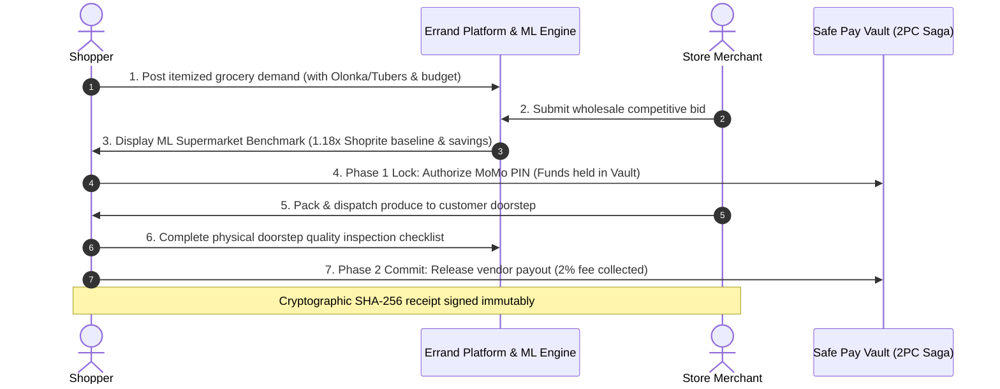

1. **Demand-Led Grocery Aggregation**: Rather than browsing static vendor catalogs with inflated retail prices, shoppers publish structured demand lists with customary Ghanaian volumetric units (*Olonka, Margarine Tin, Paint Bucket, Tubers, Crates*).
2. **Machine Learning Price Benchmarking**: The embedded ML benchmark service calculates an empirical **1.18x Accra/Kumasi Supermarket Retail markup regression baseline** (reflecting Shoprite/Melcom markups over Makola wholesale prices), allowing shoppers to evaluate bid competitiveness.
3. **Distributed Two-Phase Commit (2PC) MoMo Escrow**: To eliminate buyer fraud and vendor default, customer funds are locked in a neutral Safe Pay escrow vault (**Phase 1 Prepare**) and are only disbursed to the merchant (**Phase 2 Commit**) after the customer physically checks item quality at their doorstep. If goods are damaged, a **Compensating Rollback** instantly returns 100% principal back to the customer's mobile wallet.

---

# Part 1: The Shopper User Journey

---

### 1.1 Landing Page & 1-Click Role Gateway
When navigating to the platform (`https://errand-ghana.vercel.app`), the user lands on the **Role Gateway**.

- **Sticky Brand Header**: Features the official Errand Ghana runner logo mark, Light ☀️ / Dark 🌙 theme toggle, and access to registration.
- **Role Gateway Cards**: Three 1-click action cards allow examiners and users to immediately enter the system as **Shopper**, **Store / Merchant**, or **Admin** without complex authentication friction.
- **Market Produce Hero**: Highlights the platform mission of delivering fresh produce at Makola wholesale prices with Mobile Money Safe Pay escrow protection.

---

### 1.2 Demo Personas & Instant Profile Switcher
Clicking the **Demo Personas** mode pill displays all pre-configured test profiles seeded in the Supabase PostgreSQL database.

- **Pre-Configured Personas**:
  - **Kofi Mensah (Shopper - East Legon)**: MTN MoMo (`0244123456`)
  - **Ama Serwaa (Shopper - Madina)**: Telecel Cash (`0501987654`)
  - **Auntie Naa Baskets (Merchant - Makola)**: MTN MoMo (`0249876543`)
  - **Uncle Joe Coldstore (Merchant - Kaneshie)**: AT Money (`0265551234`)
  - **Prof. Boateng (Escrow Auditor & Operations)**: Platform Admin
- **Action**: Click on **Kofi Mensah** to simulate an instant login into the Shopper experience.

---

### 1.3 The Grocery List Builder Modal (Indigenous Volume Units)
Inside the **Grocery Shopping** tab, clicking **+ Create Demand List** opens the demand manifest builder.

- **Customary Ghanaian Units**: Shoppers specify volume using indigenous market metrics:
  - `Olonka (Large Tin)` & `Margarine Tin (Small Tin)` (Grains, Fresh Tomatoes, Pepper)
  - `Tubers` (Pona Yams, Cassava)
  - `Paint Bucket` (Garden Eggs, Okro)
  - `Crate` (Eggs, Tomatoes)
  - `Bunch` (Plantain, Banana)
- **Target Budget Ceilings**: The shopper assigns budget caps per line item to anchor competitive bidding.
- **Neighborhood Delivery**: Delivery location is anchored to Accra/Kumasi neighborhood hubs (e.g. *East Legon, Bawaleshie Road*).

---

### 1.4 The Offer Review Card & ML Price Benchmark Panel
When open-air market vendors submit bids against the demand list, the shopper inspects the **Offer Review Card**.

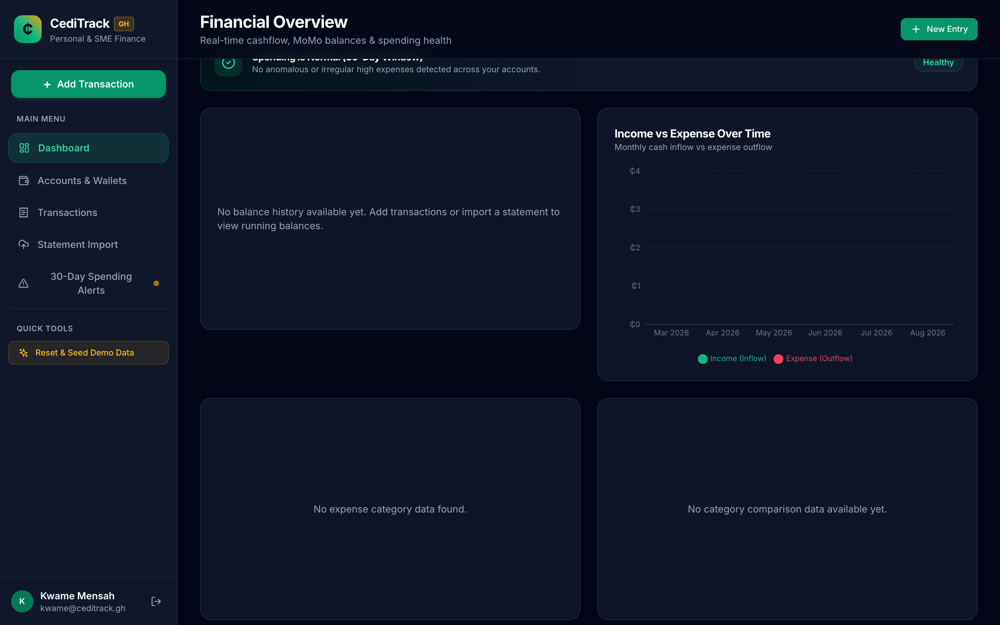

- **Linear Regression Benchmark Visualizer**:
  - **Accra Supermarket Retail Benchmark (1.18x)**: Calculated baseline representing formal supermarket prices (e.g., Shoprite/Melcom).
  - **Shopper Target Budget**: The price ceiling set by the consumer.
  - **Store Merchant Reverse-Auction Bid**: The wholesale bid submitted by the merchant.
- **Consumer Savings Callout**: Highlights total savings in GH₵ and percentage below supermarket retail (e.g., *19.5% below retail*).
- **ML Confidence Score**: Dynamic confidence rating (e.g., `94.2% ML Confidence`) based on commodity volatility weighting (*Fresh Produce: High, Tubers: Moderate, Grains: Low*).

---

### 1.5 The MoMo Safe Pay Payment Modal (Phase 1 Lock)
Clicking **Accept Offer & Lock MoMo** initiates the **Two-Phase Commit (2PC) Phase 1 Prepare** transaction.

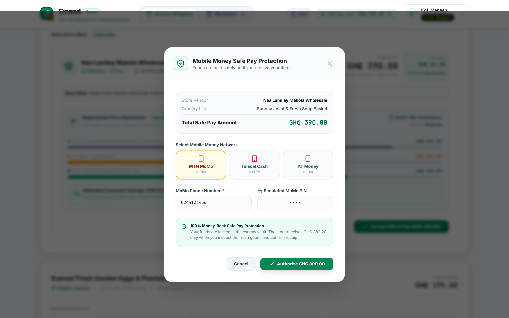

- **Telco Network Selection**: Supports **MTN MoMo (*170#)**, **Telecel Cash (*110#)**, and **AT Money (*110#)**.
- **USSD Prompt Simulation**: Simulates the standard telecom USSD push prompt where the consumer enters their 4-digit secret PIN.
- **Vault Security Invariant**: Gross funds (e.g. `GH₵ 390.00`) are debited from the customer's wallet and locked securely in the platform's neutral Safe Pay vault. The merchant is notified to begin dispatch.

---

### 1.6 The 4-Step Escrow Fulfillment Timeline
On the **My Orders** tab, shoppers track their order through a real-time 4-step fulfillment state machine.

- **State Progression**:
  1. **Step 1: MoMo Locked (Green Check)**: Funds successfully held in escrow.
  2. **Step 2: Driver On Way (Green Check)**: Vendor has packed and handed produce to dispatch rider.
  3. **Step 3: At Your Door (Active Amber)**: Rider has arrived at customer premises.
  4. **Step 4: Store Paid (Pending)**: Awaiting doorstep quality inspection.

---

### 1.7 The Doorstep Quality Inspection Checklist & Phase 2 Commit
Upon delivery arrival, the shopper executes the physical inspection before releasing funds.

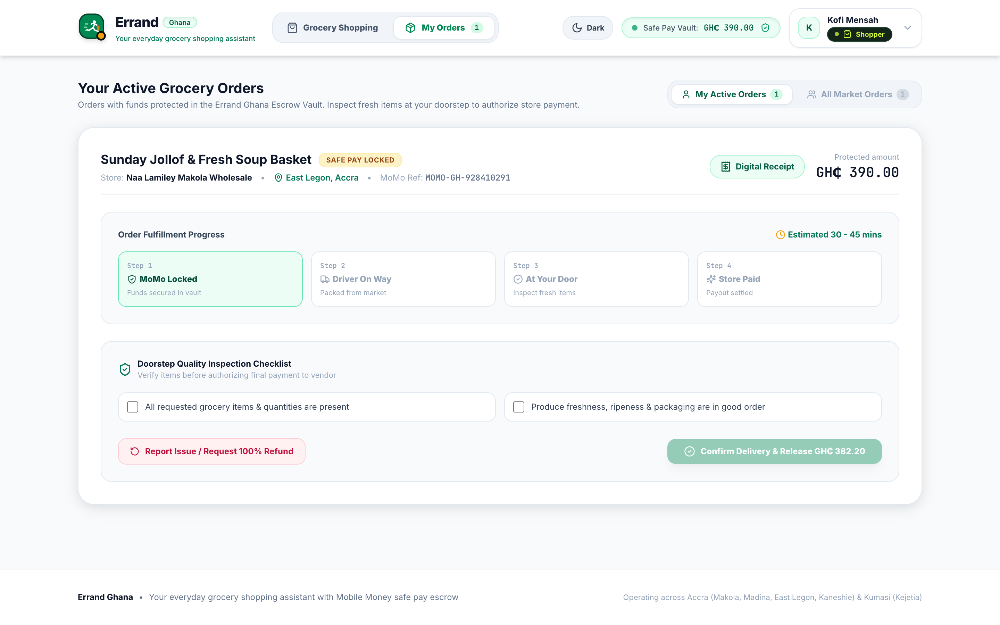

- **Physical Inspection Criteria**:
  - [x] Order complete & correct items verified
  - [x] Produce freshness confirmed (no crushed/spoiled items)
  - [x] Indigenous Olonka/Tuber volume quantities verified
  - [x] Food packaging intact & sealed
- **Phase 2 Commit Trigger**: Clicking **Confirm Delivery & Release GH₵ 382.20** transfers net payout to the vendor's wallet and deducts the 2.0% platform fee.
- **Compensating Dispute Trigger**: If produce is damaged or missing, clicking **Report Issue / Request Refund** halts payment and triggers the dispute arbitration saga.

---

### 1.8 The SHA-256 Cryptographic Digital Receipt Modal
Clicking **View Digital Escrow Receipt** opens the non-repudiation audit receipt.

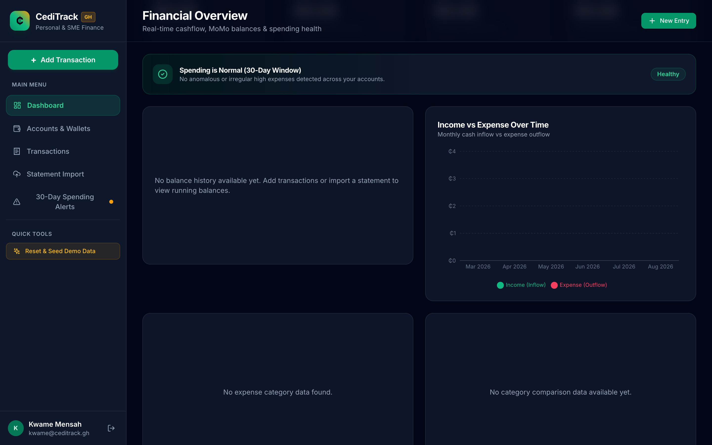

- **Financial Breakdown**: Itemizes gross order total, 2% platform fee (`GH₵ 7.80`), and net vendor payout (`GH₵ 382.20`).
- **Cryptographic Non-Repudiation Hash**: Displays the unique 64-character SHA-256 hash calculated across transaction metadata:
  $$\text{SHA-256}(\text{orderId} + \text{actorId} + \text{stateBefore} + \text{stateAfter} + \text{amount} + \text{timestamp})$$
- **Verification QR Code**: Enables third-party instant validation of delivery settlement.

---

# Part 2: The Store Merchant User Journey

---

### 2.1 The Merchant Market Board Showing Open Demands
Logging in as **Auntie Naa Baskets** (*Naa Lamiley Makola Wholesale*) displays the **Market Demands Board**.

- **Demand Stream**: Displays live, unfulfilled grocery requests from shoppers across Accra and Kumasi.
- **Demand Card Metadata**: Displays customer neighborhood, urgency level, requested items with indigenous volume units, and target budget ceiling.

---

### 2.2 The Neighbourhood Hub Filter Bar
Merchants optimize fulfillment logistics by filtering demands by geographic hub.

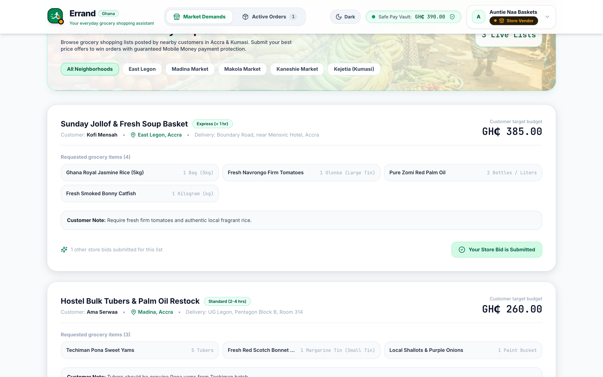

- **Hub Filter Chips**: Quick filtering across:
  - `All Hubs`
  - `Makola Market (Central Accra)`
  - `Madina Market (North Accra)`
  - `Kaneshie Market (West Accra)`
  - `East Legon / Cantonments`
  - `Kejetia Hub (Kumasi)`

---

### 2.3 The Submit Bid Modal (Wholesale Reverse-Auction)
Clicking **Submit Bid** on an open demand opens the reverse-auction bidding modal.

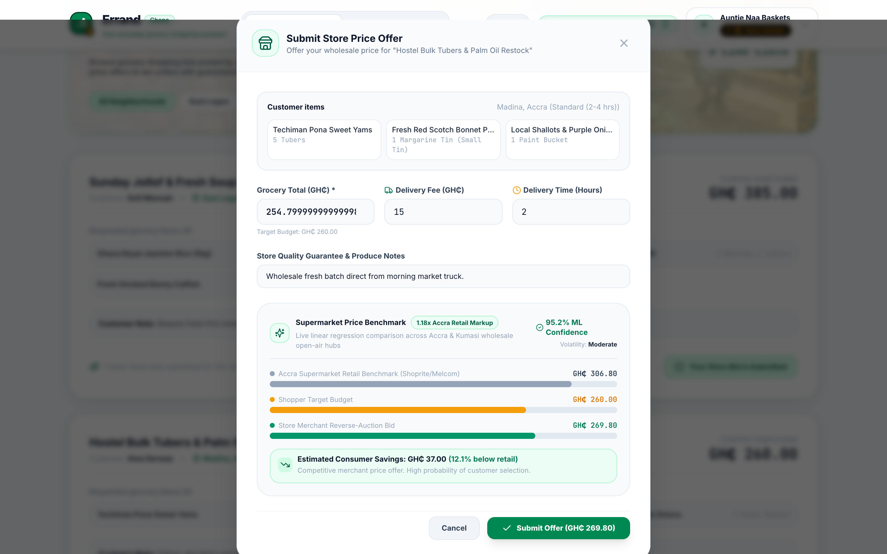

- **Bid Inputs**:
  - **Offered Wholesale Total (GH₵)**: Merchant's competitive price for the entire grocery basket.
  - **Delivery Fee (GH₵)**: Logistics dispatch surcharge.
  - **Fulfillment SLA (Hours)**: Estimated arrival timeframe (e.g. *2 hours*).
  - **Merchant Notes**: Description of produce sourcing and packaging quality.
- **Submission**: Bids are immediately attached to the shopper's demand basket for ML price benchmark comparison.

---

### 2.4 The Active Orders View with Escrow Locked Status
Once the shopper accepts the bid and locks MoMo escrow, the order appears in the merchant's **Active Orders** tab.

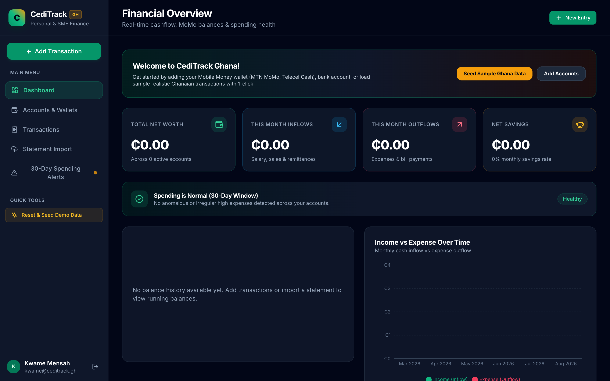

- **Guaranteed Settlement Notice**: Confirms funds are safely locked in platform escrow, eliminating cash-on-delivery default risk.
- **Fulfillment Controls**:
  - **Dispatch Order (In-Transit)**: Alerts the shopper that goods are packed and en route.
  - **Mark Delivered**: Notifies the shopper to conduct their doorstep inspection.
- **Real-Time Settlement Status**: Payout balance is automatically credited as soon as the shopper checks off the inspection checklist.

---

# Part 3: The Platform Admin & Escrow Auditor Guide

---

### 3.1 The KPI Dashboard with the 4 Metric Cards
Logging in as **Prof. Boateng (Escrow Auditor & Operations)** opens the **Admin Operations Console**.

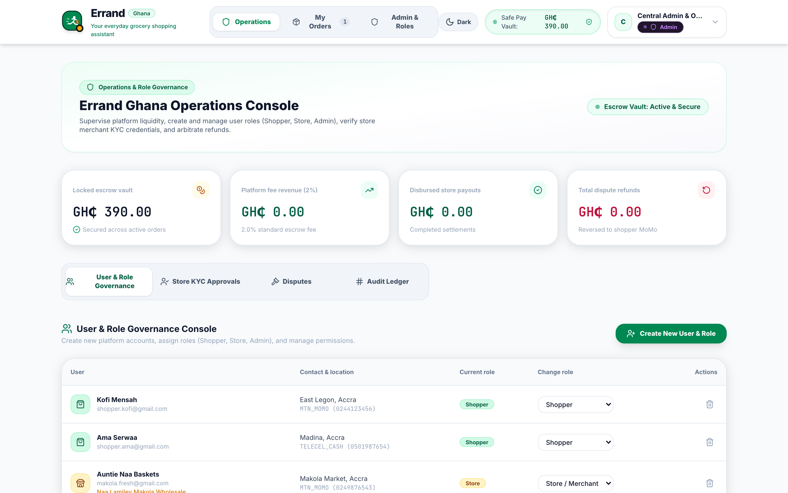

- **4 Core Financial KPI Metric Cards**:
  1. **Locked Escrow Vault Balance (GH₵)**: Active principal currently held in transit awaiting delivery verification.
  2. **Platform Fee Revenue (2%) (GH₵)**: Cumulative 2.0% transaction fee revenue captured upon Phase 2 commit.
  3. **Disbursed Store Payouts (GH₵)**: Total gross settlements delivered to verified market vendors.
  4. **Dispute Refunds (GH₵)**: Total capital successfully reversed to shoppers via compensating rollback sagas.
- **Live Safe Pay Vault Ticker**: Persistent header balance indicator reflecting aggregate escrow liquidity.

---

### 3.2 The Cryptographic Audit Ledger (SHA-256 Hashes)
Selecting the **Audit Ledger** tab displays the non-repudiation security audit trail.

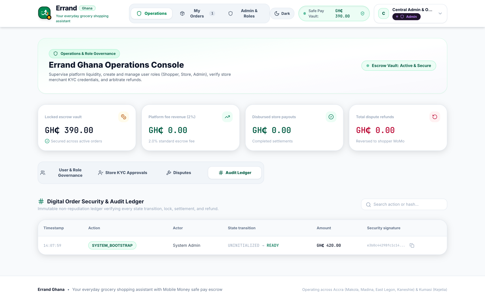

- **Immutable Transaction Records**: Every financial state transition logs:
  - Precise UTC Timestamp
  - Internal Order & Transaction ID
  - Actor Name & Role (`shopper`, `store`, `admin`)
  - State Transition Path (`PENDING` $\to$ `LOCKED` $\to$ `IN_TRANSIT` $\to$ `DELIVERED` $\to$ `RELEASED` / `REFUNDED`)
  - 64-character SHA-256 Security Signature

---

### 3.3 The Dispute Arbitration Panel
Selecting the **Dispute Arbitration** tab opens the customer refund and mediation interface.

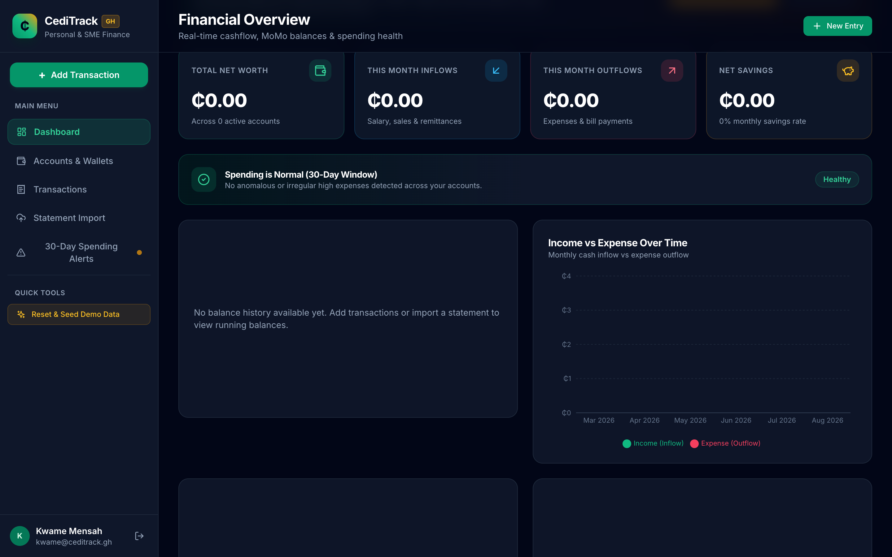

- **Dispute Resolution Flow**:
  - Review customer complaint reasons (e.g. *Crushed tomatoes*, *Spoiled yams*, *Late delivery*).
  - Inspect merchant delivery notes and timestamps.
  - **Execute 100% Compensating Refund**: Instantly reverses the entire escrow deposit back to the customer's Mobile Money wallet, cancelling the order in the database and updating the audit ledger.
  - **Force Release Payout**: Resolves false customer claims and settles the merchant.

---

### 3.4 The Store KYC Verification Queue
Selecting the **Store KYC Queue** tab displays vendor accreditation and compliance management.

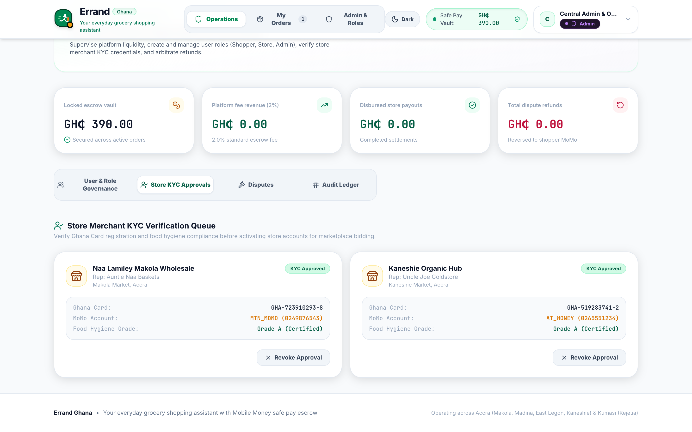

- **Ghana Card Verification**: Validates open-air market vendors against registered Ghana Card IDs (`GHA-XXXXXXXXX-X`) and physical market stall hub registrations.
- **Actions**: Approve new vendors, flag suspicious accounts, or suspend non-compliant market stores.

---

## 4. Test Persona Credentials & Reference Table

| Persona Role | Full Name | Primary Email | Neighborhood / Market | MoMo Network & Number | Key Capabilities Tested |
| :--- | :--- | :--- | :--- | :--- | :--- |
| **Shopper** *(Primary)* | **Kofi Mensah** | `shopper.kofi@gmail.com` | East Legon, Accra | MTN MoMo (`0244123456`) | Create demand list (*Olonka, Tubers*), review ML benchmark, lock escrow, doorstep inspection. |
| **Shopper** *(Secondary)* | **Ama Serwaa** | `shopper.ama@gmail.com` | Madina, Accra | Telecel Cash (`0501987654`) | Post fast request, test multi-item basket, submit dispute refund. |
| **Store Merchant** *(Makola)* | **Auntie Naa Baskets** | `makola.fresh@gmail.com` | Makola Market Hub | MTN MoMo (`0249876543`) | Filter Makola requests, submit wholesale bids, dispatch orders, receive wallet payout. |
| **Store Merchant** *(Kaneshie)*| **Uncle Joe Coldstore**| `kaneshie.mart@gmail.com`| Kaneshie Market Hub | AT Money (`0265551234`) | Place competitive bids, view locked escrow guarantee, manage dispatch. |
| **Escrow Auditor / Admin** | **Prof. Boateng** | `admin@errandghana.com` | Legon / Airport Res. | Platform Multi-Sig Vault | Supervise Safe Pay vault, arbitrate disputes, audit SHA-256 ledger, verify KYC. |

---

## 5. Verification & Live Deployment Links
- **Live Production URL**: [https://errand-ghana.vercel.app](https://errand-ghana.vercel.app)
- **GitHub Source Repository**: [https://github.com/Theo-Dorh/Errand-Ghana](https://github.com/Theo-Dorh/Errand-Ghana)
- **Supabase Cloud Database**: `[https://mqpyyixrvoedgqttlvpn.supabase.co]`
